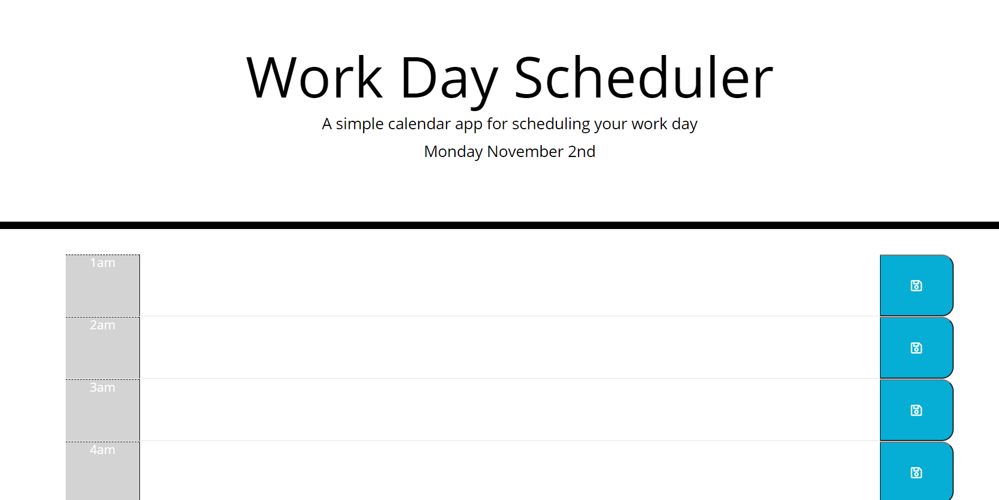

:part_alternation_mark:

# Dynamic-Day-Planner
---
 

>Link to page https://mt2314.github.io/Dynamic-Day-Planner/

## Job Requirements
---

 

>Build a Daily Planner

>Dynamically Built, Using Moment to Keep Date, and Color Coded Time Slots

>Saves to Local Storage and Time Blocks are Repopulated on Refresh

  
 

| Job Requirements                               | Solutions                                                                                       |
| ---------------------------------------------- | ----------------------------------------------------------------------------------------------- |
| WHEN I open the planner                   | THEN the current day is displayed at the top of the calendar  :heavy_check_mark:                                                          |
| WHEN I scroll down | THEN I am presented with time blocks for standard business hours:heavy_check_mark: |
| WHEN I view the time blocks for that day                 | THEN each time block is color-coded to indicate whether it is in the past, present, or future:heavy_check_mark:                                                           |
| WHEN I click into a time block            | THEN I can enter an event:heavy_check_mark:                                                              |
| WHEN I click the save button for that time block                  | THEN the text for that event is saved in local storage:heavy_check_mark:                                              |
| WHEN I refresh the page                | THEN the saved events persist:heavy_check_mark:

 
 

## Credits
---
:school: 
**University of Toronto Continuing Educationg
Full Stack Flex Program** - *Initial HTML and CSS*
:school:

:heart: 
*Students and Instructors At the UFT-FSF-2020-2021*
:heart:

:clock12:
Moment JS
:clock12:

 

## License
---

All rights reserved.

Licensed under the MIT license.
 

 

:lock::lock::lock::lock:

_____
____
___